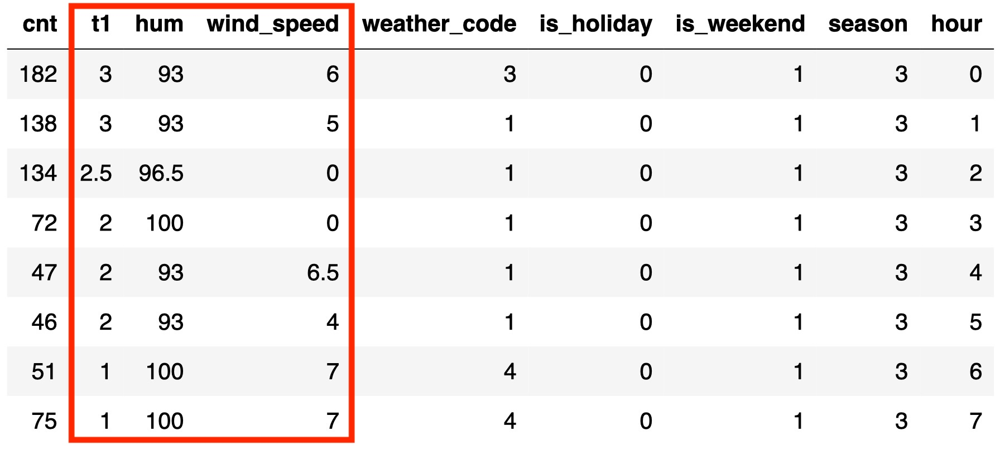
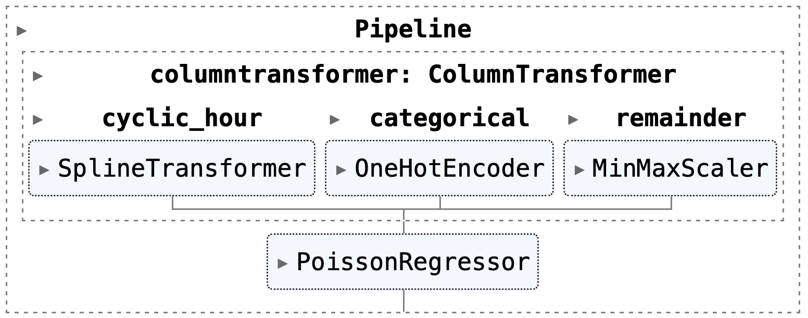
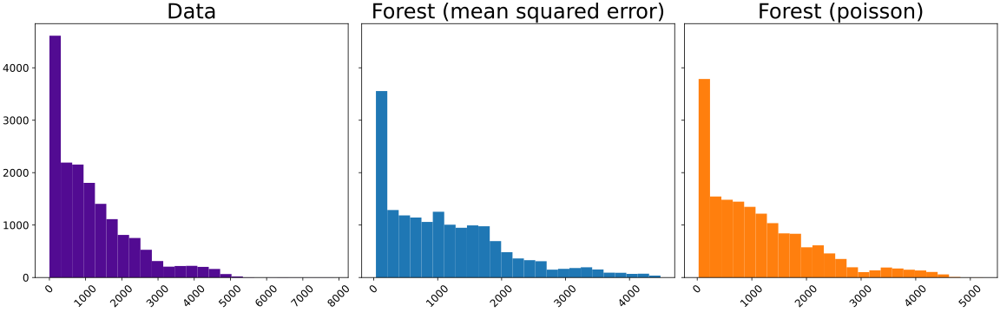

title: Counting on Poisson Regression with Scikit-learn
use_katex: True
class: title-slide

# Counting on Poisson Regression with


.larger[Thomas J. Fan]<br>
@thomasjpfan<br>
<a href="https://www.github.com/thomasjpfan" target="_blank"><span class="icon icon-github icon-left"></span></a>
<a href="https://www.twitter.com/thomasjpfan" target="_blank"><span class="icon icon-twitter"></span></a>
<a class="this-talk-link", href="https://github.com/thomasjpfan/scipy-2022-poisson" target="_blank">
This talk on Github: thomasjpfan/scipy-2022-poisson</a>

---

class: center

# Agriculture


---

class: center

# Risk modeling


---

class: center

# Predictive maintenance


---

class: top

# Poisson Regression!

## PoissonRegressor
```python
from sklearn.linear_model import PoissonRegressor

reg = PoissonRegressor()
```

--

## RandomForestRegressor
```python
from sklearn.ensemble import RandomForestRegressor

reg = RandomForestRegressor(criterion="poisson")
```

--

## HistGradientBoostingRegressor
```python
from sklearn.ensemble import HistGradientBoostingRegressor

reg = HistGradientBoostingRegressor(loss="poisson")
```

---

class: center

# Bike Sharing Dataset 🚲


---

class: center

# Bike Sharing Dataset 🚲


---

class: center

# Bike Sharing Dataset 🚲


---

class: center

# Bike Sharing Dataset 🚲



---

# ColumnTransformer

```python
preprocessor = ColumnTransformer([
    (
        "cyclic_hour",
        SplineTransformer(n_knots=13, extrapolation="periodic"),
        ["hour"]
    ),
    (
        "categorical",
        OneHotEncoder(handle_unknown="ignore"),
        ["is_holiday", "weather_code", "is_weekend", "season"]
    ),
], remainder=MinMaxScaler())
```

.center[

]

---

# ColumnTransformer

```python
preprocessor = ColumnTransformer([
    (
        "cyclic_hour",
        SplineTransformer(n_knots=13, extrapolation="periodic"),
        ["hour"]
    ),
    (
*       "categorical",
*       OneHotEncoder(handle_unknown="ignore"),
*       ["is_holiday", "weather_code", "is_weekend", "season"]
    ),
], remainder=MinMaxScaler())
```

.center[

]

---

# ColumnTransformer

```python
preprocessor = ColumnTransformer([
    (
        "cyclic_hour",
        SplineTransformer(n_knots=13, extrapolation="periodic"),
        ["hour"]
    ),
    (
        "categorical",
        OneHotEncoder(handle_unknown="ignore"),
        ["is_holiday", "weather_code", "is_weekend", "season"]
    ),
*], remainder=MinMaxScaler())
```

.center[

]

---

# ColumnTransformer

```python
preprocessor = ColumnTransformer([
    (
*       "cyclic_hour",
*       SplineTransformer(n_knots=13, extrapolation="periodic"),
*       ["hour"]
    ),
    (
        "categorical",
        OneHotEncoder(handle_unknown="ignore"),
        ["is_holiday", "weather_code", "is_weekend", "season"]
    ),
], remainder=MinMaxScaler())
```

.center[

]

---

# Periodic spline features

.center[

]

- [Time-related feature engineering example](https://scikit-learn.org/stable/auto_examples/applications/plot_cyclical_feature_engineering.html#sphx-glr-auto-examples-applications-plot-cyclical-feature-engineering-py)

---


class: chapter-slide

# PoissonRegressor 🎢

---

class: top

<br>
<br>

# Generalized Linear Models (GLM)

$$
\hat{y}(w, X) = h(Xw)
$$

where $\hat{y}$ is the predicted values, $X$ are features, and $h$ is the inverse link function.

--

<br>

## Minimization problem becomes:

$$
\min_{w}\frac{1}{2n} \sum_i d(y_i, \hat{y}_i) + \frac{\alpha}{2}||w||_2^2
$$

where $\alpha$ is the L2 regularization penalty.


.footnote-back[
[User Guide](https://scikit-learn.org/stable/modules/linear_model.html#generalized-linear-regression)
]

---

# Deviance


.footnote-back[
[User Guide](https://scikit-learn.org/stable/modules/linear_model.html#generalized-linear-regression)
]

---

class: top

# Minimization Problem

`scipy.optimize.minimize` is used with `L-BFGS-B`

$$
\min_{w}\frac{1}{2n} \sum_i d(y_i, \hat{y}_i) + \frac{\alpha}{2}||w||_2^2
$$

--

- Cholesky based Newton solver: [PR #23314](https://github.com/scikit-learn/scikit-learn/pull/23314)
- Newton-LSMR: [PR #23507](https://github.com/scikit-learn/scikit-learn/pull/23507)

--

<br>

## Regularization by Default!

.center.larger[
`PoissonRegressor(alpha=1.0)`
]

---

class: top

# Preprocessor + Linear Model

## Poisson

```python
poisson = make_pipeline(preprocessor, PoissonRegressor(...))
```

.center[

]

--

## Ridge

```python
ridge = make_pipeline(preprocessor, Ridge())
```

---

# Evaluation

```python
from sklearn.model_selection import TimeSeriesSplit

cv = TimeSeriesSplit(
    n_splits=50,
    max_train_size=10000,
    test_size=336,
)
```

---

# Results - Linear Models


---

# Distributions - Linear Models


---

# Calibration for Regression

.g.g-middle[
.g-8[

]
.g-4[
<!--  -->
]
]

---

# Calibration for Regression

.g.g-middle[
.g-8[

]
.g-4[
<!--  -->
]
]

---

# Calibration for Regression

.g.g-middle[
.g-8[

]
.g-4[
<!--  -->
]
]

---

# Calibration for Regression

.g.g-middle[
.g-8[

]
.g-4[

]
]


---

# Calibration - Linear Models


---

class: chapter-slide

# Random Forest 🎄🎄🎄

---

# Random Forest With Poisson 🎄🎄🎄

.larger[
**`RandomForestRegressor(criterion="poisson")`**
]

---

# How does Poisson Influence the Random Forest?

$$
\text{H}(Q) = \dfrac{1}{n}\sum_{i\in Q} y_i * \log\left(\dfrac{y_i}{\hat{y}_i}\right) + \hat{y}_i - y_i
$$

.g.g-middle[
.g-6[

where
- $y_i$ is the true value
- $\hat{y}_i$ is the predicted value
- $Q$ is a node,
- $n$ is the number of data points in node.

]
.g-6[

]
]

.footnote-back[
[Details in User Guide](https://scikit-learn.org/stable/modules/tree.html#mathematical-formulation)
]

---

# Random Forest

.center[

]

---

# Results - Random Forest


---

# Distributions - Random Forest



---

# Calibration - Random Forest


---

class: chapter-slide

# Histogram-based Gradient Boosting Trees 🏂

---

# HistGradientBoostingRegressor With Poisson 🏂

.larger[
**`HistGradientBoostingRegressor(loss="poisson")`**
]

---

class: top

# HistGradientBoostingRegressor Overview 🏂

## Initial Condition

$$
\hat{f}^{(0)} = C
$$

where $C$ is the maximum likelihood estimate for **loss**.

--

## Iterations

$$
\hat{f}^{(t)}=\hat{f}^{(t-1)} + \nu \hat{h}^{(t)}
$$

where

- $\hat{f}^{(t)}$ is the regressor at iteration $t$
- $\nu$ are learning rate
- $\\hat{h}^{(t)}$ are trees using the **gradient** and **hessians**.

---

class: top

<br>

# How does Poisson Influence the Algorithm?
## Growing Trees $\hat{h}^{(t)}$ by to evaluating splits:

.g[
.g-8[

$$
\text{Gain} = \frac{1}{2}\left[\dfrac{G_L^2}{H_L+\lambda} + \dfrac{G_R^2}{H_R+\lambda} - \frac{(G_L+G_R)^2}{H_L+H_R+\lambda}\right]
$$

where
- $\lambda$ is the l2 regularization
- $G_L$ and $G_R$ is sum of the **gradients**
- $H_L$ and $H_R$ is sum of the **hessians**

]

.g-4[

]
]

--

## More Details @

[SciPy 2019 Fast Gradient Boosting Decision Trees with PyGBM and Numba](https://www.youtube.com/watch?v=cLpIh8Aiy2w)

---

class: top

<br>

# Linking $f$ with $y$

$$
\hat{y}^{(t)} = h(\hat{f}^{(t)})
$$

where $h$ is the inverse link function.

--

## Poisson's Inverse Link function

$$
h(z) = \exp(z)
$$

--

## Looks link the GLMs

$$
\hat{y}(w, X) = h(Xw)
$$

---


# Results - Hist Gradient Boosting


---

# Results - Hist Gradient Boosting 🔎


---

# Distributions - Hist Gradient Boosting


---

# Calibration - Hist Gradient Boosting


---

# Example of Predictions


---

# Poisson Regression with Bike Share Data 🚲🚲🚲

## `PoissonRegressor()`
## `RandomForestRegressor(criterion="poisson")`
## `HistGradientBoostingRegressor(loss="poisson")`

---

class: chapter-slide

# Two More Topics 🔎

---

# Zero-Inflated Poisson Regression


---

# Zero-Inflated Poisson Regression

## Scikit-lego!

.larger[
```python
from sklego.meta import ZeroInflatedRegressor

poisson_zero =  ZeroInflatedRegressor(
*    classifier=HistGradientBoostingClassifier(),
*    regressor=HistGradientBoostingRegressor(loss="poisson"),
)
```
]

---

# Exposure


---

# Exposure

```python
df["Frequency"] = df["ClaimNb"] / df["Exposure"]

poisson_gbrt.fit(
    df_train, df_train["Frequency"],
*   regressor__sample_weight=df_train["Exposure"],
)
```

[Poisson regression and non-normal loss example](https://scikit-learn.org/stable/auto_examples/linear_model/plot_poisson_regression_non_normal_loss.html#sphx-glr-auto-examples-linear-model-plot-poisson-regression-non-normal-loss-py)

---

class: title-slide, left

.center[
# Counting on Poisson Regression

]

.g[
.g-9[
#### `PoissonRegressor()`
#### `RandomForestRegressor(criterion="poisson")`
#### `HistGradientBoostingRegressor(loss="poisson")`
]
.g-3.center[
Thomas J. Fan<br>
@thomasjpfan<br>
<a href="https://www.github.com/thomasjpfan" target="_blank"><span class="icon icon-github icon-left"></span></a><a href="https://www.twitter.com/thomasjpfan" target="_blank"><span class="icon icon-twitter"></span></a>
]

]

.center[
<a class="this-talk-link", href="https://github.com/thomasjpfan/scipy-2022-poisson" target="_blank">
This workshop on Github: github.com/thomasjpfan/scipy-2022-poisson</a>
]
